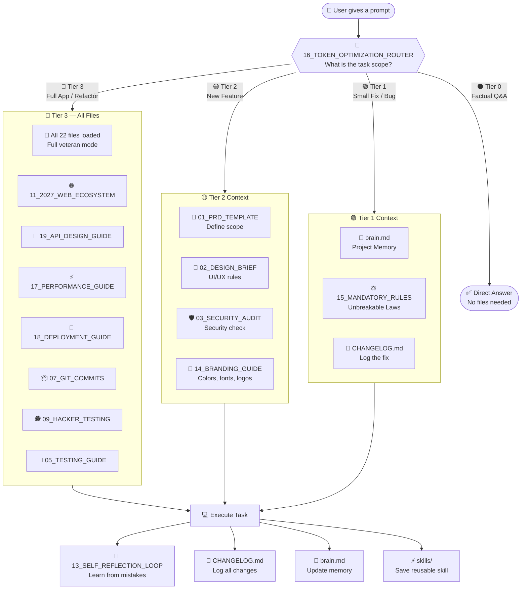

# 🗺️ MANIFEST.md — System Architecture Map

> This document is the master reference for the Vibe Ecosystem system. 
It defines how the AI navigates files, manages tokens, and executes workflows.

---

## 📐 System Flow Diagram

---

## 📁 Complete File Index

### 🧭 Core System (Always Available)
| File | Purpose | Tier Needed |
|---|---|---|
| `00_SYSTEM_INSTRUCTIONS.md` | Master persona + reading order | All |
| `brain.md` | Persistent project memory | Tier 1+ |
| `16_TOKEN_OPTIMIZATION_ROUTER.md` | Smart context routing | All (first) |
| `15_MANDATORY_RULES.md` | 7 unbreakable laws | Tier 1+ |
| `CHANGELOG.md` | Strict change log | Tier 1+ |

### 📐 Planning & Design (Tier 2+)
| File | Purpose | Reads Into |
|---|---|---|
| `01_PRD_TEMPLATE.md` | Product requirements | → 02_DESIGN_BRIEF |
| `02_DESIGN_BRIEF.md` | UI/UX rules (2027) | → 14_BRANDING_GUIDE |
| `14_BRANDING_GUIDE.md` | Color system, fonts, SVG logos | → 02_DESIGN_BRIEF |

### 🔐 Security & Quality (Tier 2+)
| File | Purpose | Reads Into |
|---|---|---|
| `03_SECURITY_AUDIT.md` | Pre-deploy security checklist | → 09_HACKER_TESTING |
| `09_HACKER_TESTING.md` | Red-team attack simulation | → 03_SECURITY_AUDIT |
| `15_MANDATORY_RULES.md` | Module isolation, no placeholders | → CHANGELOG |
| `SECURITY.md` | What never to push to GitHub | → .gitignore |

### 💻 Development (Tier 2+)
| File | Purpose | Reads Into |
|---|---|---|
| `04_DEBUGGING_PROTOCOL.md` | Structured bug fixing | → 13_SELF_REFLECTION |
| `05_TESTING_GUIDE.md` | Vitest + Playwright strategy | → 17_PERFORMANCE |
| `06_CLEANUP_RULES.md` | Dead code removal | → 07_GIT_COMMITS |
| `08_SKILL_CREATION.md` | Convert tasks to reusable skills | → skills/README |
| `10_MEMORY_MANAGEMENT.md` | brain.md compression | → brain.md |
| `12_AUTONOMOUS_RESEARCH.md` | Web research before guessing | → CHANGELOG |
| `19_API_DESIGN_GUIDE.md` | REST vs tRPC vs GraphQL | → 03_SECURITY |

### 🚀 Shipping (Tier 3)
| File | Purpose | Reads Into |
|---|---|---|
| `07_GIT_COMMITS.md` | Branch strategy + commits | → 18_DEPLOYMENT |
| `11_2027_WEB_ECOSYSTEM.md` | Modern stack spec | → 17_PERFORMANCE + 19_API |
| `17_PERFORMANCE_GUIDE.md` | Core Web Vitals, Lighthouse CI | → 18_DEPLOYMENT |
| `18_DEPLOYMENT_GUIDE.md` | Vercel + Cloudflare deploy | → 07_GIT_COMMITS |

### 🤖 AI Self-Improvement (Every Turn)
| File | Purpose | Reads Into |
|---|---|---|
| `13_SELF_REFLECTION_LOOP.md` | Learn from mistakes | → brain.md [LESSONS] |
| `FEATURES.md` | Feature roadmap + bekahr list | → 01_PRD_TEMPLATE |
| `TODO.md` | Sprint task tracking | → CHANGELOG |

### 📚 Skills Library
| File | Purpose |
|---|---|
| `skills/README.md` | Index of reusable task templates |
| `skills/*.md` | Individual skill files (added over time) |

---

## 🔗 Cross-Reference Quick Guide

> When working on X, also check Y:

| Working on... | Also read... |
|---|---|
| New app idea | `01_PRD` → `14_BRANDING` → `02_DESIGN` |
| API endpoint | `19_API_DESIGN` → `03_SECURITY` → `09_HACKER` |
| Deployment | `07_GIT` → `17_PERFORMANCE` → `18_DEPLOYMENT` |
| Bug fix | `04_DEBUGGING` → `13_SELF_REFLECTION` → `CHANGELOG` |
| UI component | `02_DESIGN` → `14_BRANDING` → `05_TESTING` |
| Database schema | `01_PRD` → `03_SECURITY` → `19_API_DESIGN` |
| Performance issue | `17_PERFORMANCE` → `11_2027_WEB` → `06_CLEANUP` |

---

## 📊 System Stats
| Metric | Value |
|---|---|
| Total Files | 28 (including skills/) |
| Core System Files | 22 |
| Skills Library | Expandable |
| Token Router Tiers | 4 (0, 1, 2, 3) |
| Max Token Savings | 90% (Tier 0) |
| Security Checks | 8 attack vectors |
| 2027 Standards | WebNN, WebGPU, PWA, SSE, Edge |

**Related Files:** [00_SYSTEM_INSTRUCTIONS.md](00_SYSTEM_INSTRUCTIONS.md) | [16_TOKEN_OPTIMIZATION_ROUTER.md](16_TOKEN_OPTIMIZATION_ROUTER.md) | [README.md](README.md)
